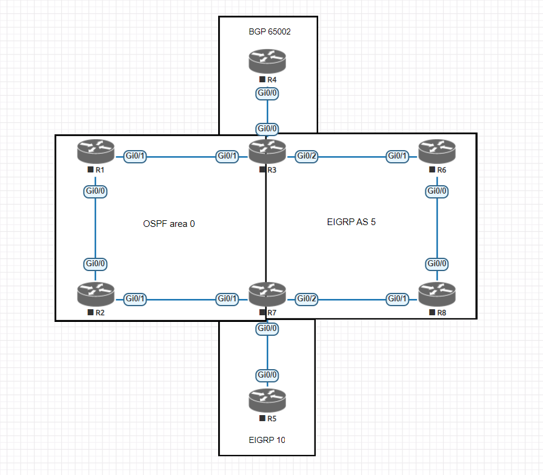

**Note:** One of the things that I noticed on my first attempt of the ENARSI exam was that I was very poor at going into new topologies, evaluating them, and quickly making the required configurations. To help myself with this, I'm creating multiple different topologies, but also multiple labs with the same topologies that have different IP addressing. Due to this, the image of the lab topology does not contain any addressing information.

## Topology



## Tasks
* To start, please setup the topology as seen in the image above and copy the configuration to each device

1. Make sure R2 uses the path through R1 -> R3 -> R6 to get to R8's loopback address
2. Make sure R6 uses the path through R2 -> R1 -> R3 to get to R6's loopback address
3. Make sure that all traffic from R1's loopback goes through R3 -> R6 to reach R7's loopback address. All other traffic from R1 should use the path through R2 to Reach R7's loopback
4. Make sure that all routers in EIGRP AS 5 only have one path to R2's loopback IP (through R3). The routers should not know how to reach R2's loopback via R7
5. Create DMVPN tunnels between R4 and R2/R8. Should be using DMVPN phase 3. Tunnel IPs should be in the 192.168.1.0/24 network.  
6. Configure RIP on the DMVPN tunnels and redistribute between all routing protocols. 


## Configuration:

### R1 Configuration

```
conf t
hostname R1
line con 0
logging sync
int gig 0/0
ip add 10.15.27.5 255.255.255.252
no shut
int gig 0/1
ip add 10.15.27.1 255.255.255.252
no shut
int lo 0
ip add 10.1.1.1 255.255.255.255
router ospf 1
network 10.0.0.0 0.255.255.255 area 0
```

### R2 Configuration

```
conf t
hostname R2
line con 0
logging sync
int gig 0/0
ip add 10.15.27.6 255.255.255.252
no shut
int gig 0/1
ip add 10.15.12.1 255.255.255.252
no shut
int lo 0
ip add 10.2.2.2 255.255.255.255
router ospf 1
network 10.0.0.0 0.255.255.255 area 0
```

### R3 Configuration

```
conf t
hostname R3
line con 0
logging sync
int gig 0/0
ip add 22.0.0.1 255.255.255.240
no shut
int gig 0/1
ip add 10.15.27.2 255.255.255.252
no shut
int gig 0/2
ip add 172.16.0.1 255.255.255.0
no shut
int lo 0
ip add 10.3.3.3 255.255.255.255
router ospf 1
network 10.0.0.0 0.255.255.255 area 0
redistribute bgp 65002 subnets
redistribute eigrp 1 subnets
router eigrp 1
network 172.16.0.0 0.0.255.255
redistribute ospf 1 metric 100000 100 255 1 1500
redistribute bgp 65002 metric 100000 100 255 1 1500
router bgp 65002
bgp redistribute-internal
neighbor 22.0.0.1 remote-as 65002
neighbor 22.0.0.1 next-hop-self
network 22.0.0.0 mask 255.255.255.240
redistribute EIGRP 1 
redistribute ospf 1
```

### R4 Configuration

```
conf t
hostname R4
line con 0
logging sync
int gig 0/0
ip add 22.0.0.1 255.255.255.240
no shut
int lo 0
ip add 22.4.4.4 255.255.255.255
int lo 1
ip add 22.5.5.5 255.255.255.255
int lo 2
ip add 22.6.6.6 255.255.255.255
router bgp 65002
neighbor 22.0.0.2 remote-as 65002
neighbor 22.0.0.2 next-hop-self
network 22.0.0.0 mask 255.255.255.240
network 22.4.4.4 mask 255.255.255.255
network 22.5.5.5 mask 255.255.255.255
network 22.6.6.6 mask 255.255.255.255
```

### R5 Configuration

```
conf t
hostname R5
line con 0
logging sync
int gig 0/0
ip add 180.0.0.1 255.255.255.252
no shut
int lo 0
ip add 180.5.5.5 255.255.255.255
int lo 1
ip add 180.6.6.6 255.255.255.255
int lo 2
ip add 180.7.7.7 255.255.255.255
router eigrp 10
network 180.0.0.0 0.255.255.255
```

### R6 Configuration

```
conf t
hostname R6
line con 0
logging sync
int gig 0/0
ip add 172.16.68.1 255.255.255.0
no shut
int gig 0/1
ip add 172.16.0.6 255.255.255.0
no shut
int lo 0
ip add 172.16.6.6 255.255.255.255
router eigrp 1
network 172.16.0.0 0.0.255.255
```

### R7 Configuration

```
conf t
hostname R7
line con 0
logging sync
int gig 0/0
ip add 180.0.0.2 255.255.255.252
no shut
int gig 0/1
ip add 10.15.12.2 255.255.255.252
no shut
int gig 0/2
ip add 172.16.55.1 255.255.255.252
no shut
int lo 0
ip add 172.16.7.7 255.255.255.255
router ospf 1
network 10.0.0.0 0.255.255.255 area 0
redistribute eigrp 1 subnets metric-type 1
redistribute eigrp 10 subnets
router eigrp 1
network 172.16.0.0 0.0.255.255
redistribute eigrp 10
redistribute ospf 1 metric 100000 100 255 1 1500
router eigrp 10
redistribute eigrp 1
redistribute ospf 1 metric 100000 100 255 1 1500
network 180.0.0.0 0.255.255.255
```

### R8 Configuration

```
conf t
hostname R8
line con 0
logging sync
int gig 0/0
ip add 172.16.68.2 255.255.255.0
no shut
int gig 0/1
ip add 172.16.55.2 255.255.255.252
no shut
int lo 0
ip add 172.16.8.8 255.255.255.255
router eigrp 1
network 172.16.0.0 0.0.255.255
```

